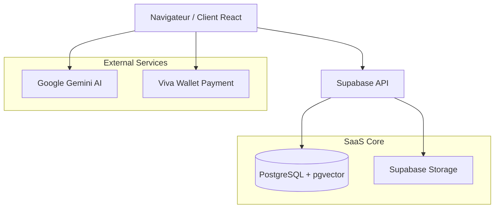

# 🏛 Architecture Système — Green Moon SaaS

Ce document détaille l'organisation technique, les choix architecturaux et le flux de données de l'application.

---

## 🗺 Vue d'ensemble

L'application repose sur une architecture moderne **Serverless-first** :

---

## 🎨 Frontend (Client-side)

### Structure des Composants
- **Composants atomiques** : Boutons, entrées, cartes produits (`src/components/ui`).
- **Composants métier** : Layouts, en-têtes dynamiques, gestionnaires de panier.
- **Pages** : Composants de pages routés via `react-router-dom`.

### Gestion d'État
- **Zustand** : Utilisé pour la gestion d'état réactive (panier, authentification utilisateur, préférences boutique).
- **LocalStorage** : Persistance du panier et de la session utilisateur.

### Routing & Navigation
L'application gère nativement le **multi-tenant** :
- Routes globales : `/`, `/catalogue`, `/connexion`, `/register-shop`.
- Routes boutiques : Gérées via filtrage dynamique par `shop_id` ou `subdomain`.

---

## ⚙️ Backend (BaaS)

### Couches applicatives
- **Supabase Auth** : Gestion complète des utilisateurs, rôles (client vs admin) et sessions.
- **Supabase Database** : PostgreSQL avec extensions `pgvector` pour la recherche sémantique.
- **Supabase Storage** : Hébergement des images produits, bannières et logos.

### Sécurité (RLS)
L'ensemble de la sécurité est piloté directement au niveau de la base de données via **Row Level Security (RLS)** :
- Un client ne peut voir que son profil et ses commandes.
- Un admin de boutique ne peut modifier que les données liées à sa boutique.
- L'accès anonyme est limité à la lecture du catalogue public.

---

## 🤖 Services d'Intelligence Artificielle

### Budtender IA
- **Modèle** : Google Gemini-1.5-flash.
- **Rôle** : Recommander des produits en fonction de l'humeur, des goûts ou des besoins thérapeutiques de l'utilisateur.
- **Intégration** : Via le SDK `@google/genai` directement depuis le client.

### Recherche Vectorielle
- Les descriptions produits sont converties en **embeddings** (768 dimensions) via Gemini.
- Ces vecteurs sont stockés dans la colonne `embedding` de la table `products`.
- La recherche sémantique (`match_products`) utilise la distance cosinus pour trouver les produits les plus pertinents.

---

## 🏛 Décisions d'Architecture (ADR)

1. **Pourquoi React 19 + Vite ?**
   - Performance maximale pour une application monopage (SPA) fluide avec animations complexes (Framer Motion).
2. **Pourquoi Supabase au lieu d'un backend Node/Express ?**
   - Gain de temps massif sur l'infrastructure (Auth, Realtime, DB). Tout le code métier complexe est déporté dans des fonctions SQL ou géré via RLS.
3. **Pourquoi pgvector ?**
   - Permet de combiner recherche SQL classique (prix, stock) et recherche sémantique IA (goût, effet) dans une seule requête atomique.
4. **Pourquoi Tailwind 4 ?**
   - Système de design moderne, plus performant et compatible nativement avec Vite.
