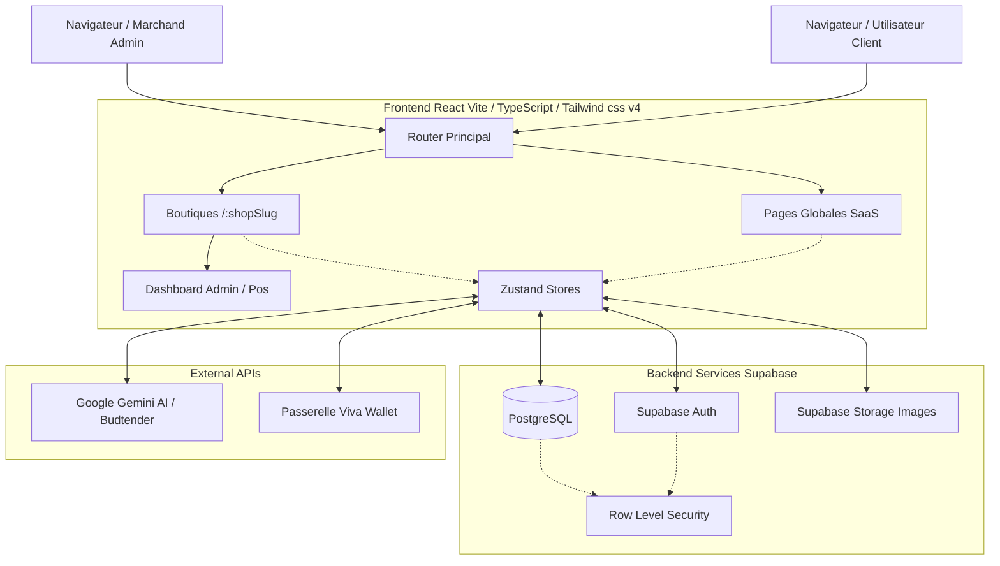

# Architecture Système et Logicielle

Ce document présente l'architecture globale de **Green IA SaaS**, une plateforme E-commerce Multi-tenant.

## 🏗️ Vue d'ensemble

Le projet suit une architecture dite **Client Lourd / BaaS (Backend as a Service)**, sans serveur applicatif Python, Node.js, ou PHP intermédiaire complexe. La logique "backend" se trouve très majoritairement gérée par **Supabase**.

## 🖥️ Frontend (React & TypeScript)

- **SPA (Single Page Application)** : Livrée via un CDN (Vercel ou équivalent) offrant un temps de chargement minime.
- **Routing Dynamique** : Les chemins root `/` ou non préfixés affichent le site vitrine/SaaS (Home, Inscription...). Les chemins préfixés `/:shopSlug` (ex: `/ma-boutique/produits`) redirigent l'utilisateur vers le store spécifique d'un marchand. 
- **Stores Zustand** : Pour limiter le passage infernal de "Props", les états comme l'authentification (`useAuthStore`), les paniers (`useCartStore`) ou la personnalisation de la boutique (`useThemeStore`) sont centralisés avec Zustand.
- **Hooks & Composants UI** : La conception est modulaire. Les composants de base (boutons multiples, loaders) sont indépendants des composants complexes (tunnel de commande, interface IA).

## ⚙️ Backend as a Service (Supabase)

Supabase encapsule notre base de données PostgreSQL derrière des règles de sécurité.

- **PostgREST** : Au lieu d'écrire des API CRUD (Create, Read, Update, Delete) à la main (avec Express.js/Nest.js par exemple), le frontend tape directement et de façon asynchrone dans les tables Supabase (ex: `supabase.from('products').select('*')`).
- **PostgreSQL et RLS (Row Level Security)** : Essentiel pour le multi-tenant. Les policies PostgreSQL garantissent qu'un client ne voit que ses commandes et qu'un Marchand ne gère que les produits de sa propre boutique (grâce à l'id du profil de la boutique affiliée).
- **Trigger(s) SQL** : Utilisés pour la synchronisation automatique (ex: Création d'un profil automatiquement lorsqu'un utilisateur s'inscrit, mise à jour de timestamps, décrémentation des stocks etc.).
- **Auth & Storage** : Supabase gère entièrement le système de JWT (via magic link, e-mail/mot de passe), ainsi que l'hébergement des médias (images produits, bannières marchands).

## 🤖 Intelligence Artificielle (Budtender)

- **Intégration** : Réalisée via `@google/genai`. 
- **Rôle** : Recommander des articles en temps réel de manière vocale ou textuelle (Gemini Live API), en s'appuyant potentiellement sur le contexte de la boutique naviguée par le client. Le navigateur crée la connexion websocket au service LLM, ce qui décharge d'autant l'application.

## 💳 Paiements (Viva Wallet Integration)
L'intégration native des processus de paiements (Smart Checkout via Viva Wallet ou intégration API stricte) se gère via des environnements de "sandbox" pour les environnements de test et une validation sécurisée. 

## 🛡️ Sécurité
1. Aucune clé API secrète de type Write (Gemini, Supabase Service Role) n'est partagée côté client. Seule les clés publiques/anonymes sont exposées (`VITE_SUPABASE_ANON_KEY`).
2. Row Level Security : Bloque les requêtes non authentifiées ou dont le jeton (token JWT) ne correspond pas à l'appartenance de la donnée appelée (notamment pour l'admin/multi-tenant).
