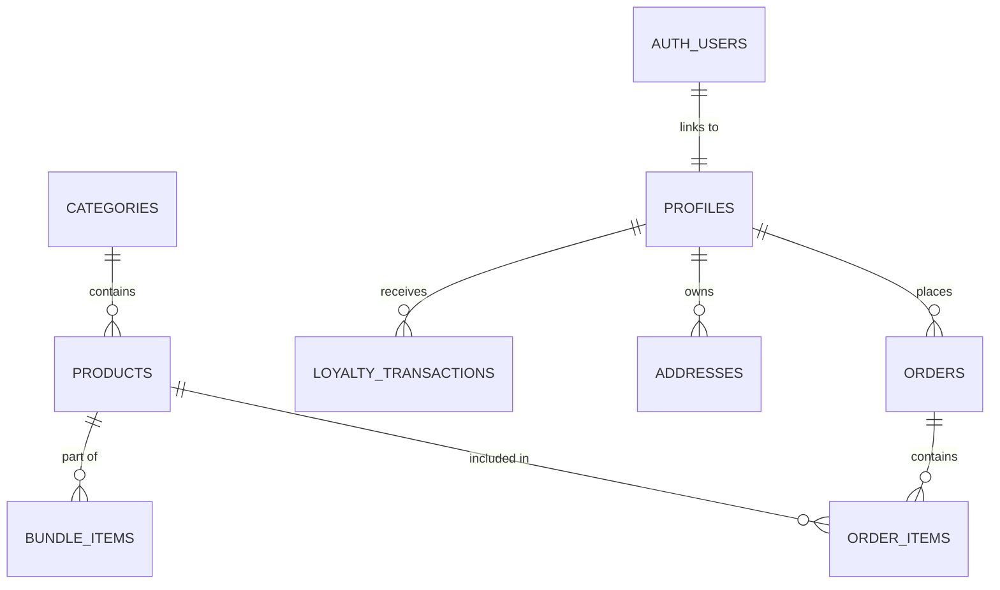

# 🗄️ Schéma de Base de Données — Green Moon SaaS

Ce document fournit une référence complète du schéma PostgreSQL hébergé sur Supabase.

---

## 🏗️ Tables Principales

### 1. `categories`
*Stocke les catégories de produits pour le catalogue.*

| Colonne | Type | Contraintes | Description |
| :--- | :--- | :--- | :--- |
| `id` | `uuid` | PK | Identifiant unique (auto-généré) |
| `slug` | `text` | UNIQUE, NOT NULL | Identifiant textuel pour les URLs |
| `name` | `text` | NOT NULL | Nom de la catégorie |
| `description` | `text` | - | Description longue |
| `icon_name` | `text` | - | Nom de l'icône Lucide correspondante |
| `sort_order` | `int` | DEFAULT 0 | Ordre d'affichage |
| `is_active` | `boolean` | DEFAULT true | Statut d'activation |

### 2. `products`
*Table centrale contenant les fiches articles.*

| Colonne | Type | Contraintes | Description |
| :--- | :--- | :--- | :--- |
| `id` | `uuid` | PK | Identifiant unique |
| `category_id` | `uuid` | FK (categories) | Catégorie parente |
| `slug` | `text` | UNIQUE, NOT NULL | Slug SEO |
| `name` | `text` | NOT NULL | Nom du produit |
| `price` | `numeric(10,2)`| NOT NULL | Prix unitaire |
| `stock_quantity`| `int` | DEFAULT 0 | Quantité disponible |
| `cbd_percentage`| `numeric(5,2)`| - | Taux de CBD (CBD spécifique) |
| `embedding` | `vector(768)`| - | Vecteur pour la recherche IA Gemini |
| `attributes` | `jsonb` | DEFAULT '{}' | Caractéristiques dynamiques |

### 3. `profiles`
*Profils utilisateurs étendus (Auth.users).*

| Colonne | Type | Contraintes | Description |
| :--- | :--- | :--- | :--- |
| `id` | `uuid` | PK, FK (auth.users) | Identifiant utilisateur |
| `full_name` | `text` | - | Nom complet |
| `is_admin` | `boolean` | DEFAULT false | Rôle administrateur de boutique |
| `loyalty_points`| `int` | DEFAULT 0 | Solde de points de fidélité |
| `referral_code` | `text` | UNIQUE | Code de parrainage client |

### 4. `orders`
*Gestion des transactions et états de commande.*

| Colonne | Type | Contraintes | Description |
| :--- | :--- | :--- | :--- |
| `id` | `uuid` | PK | Identifiant de commande |
| `user_id` | `uuid` | FK (profiles) | Client ayant passé commande |
| `status` | `text` | DEFAULT 'pending' | `pending`, `paid`, `shipped`, `cancelled` |
| `total` | `numeric(10,2)`| NOT NULL | Montant total TTC |
| `delivery_type` | `text` | - | `click_collect` ou `delivery` |

---

## 🤖 Tables IA & Interactions

### `budtender_interactions`
*Historique des sessions avec le conseiller IA.*

- `interaction_type` : `'chat_session'`, `'quiz_result'`.
- `quiz_answers` : `jsonb` (données du questionnaire IA).
- `recommended_products` : `uuid[]` (liste des produits suggérés).

---

## 🔐 Politiques RLS (Sécurité)

- **Lecture publique** : `categories`, `products` (si `is_active = true`).
- **Lecture propriétaire** : `profiles`, `addresses`, `orders`, `loyalty_transactions`.
- **Admin uniquement** : `stock_movements`, `pos_reports`, `promo_codes`.

---

## 📊 Diagramme de Relation (ERD)

---

> [!NOTE]
> Le schéma complet consolidé est disponible dans [supabase/schema_complet.sql](file:///c:/Users/Mayss/Documents/GitHub/Green-Moon-project%20-%20SAAS/supabase/schema_complet.sql).
