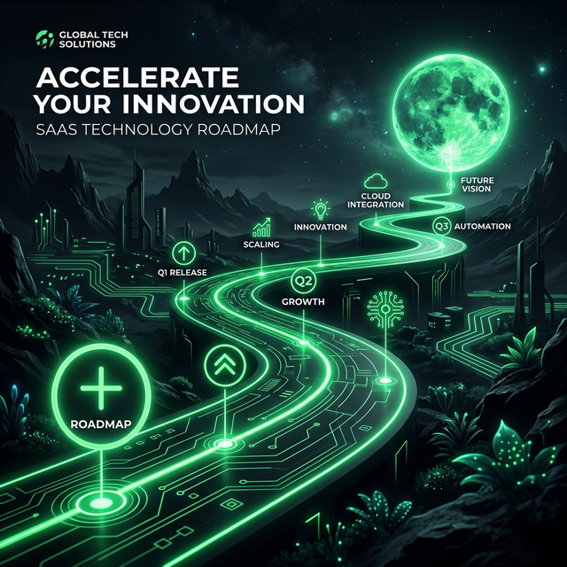
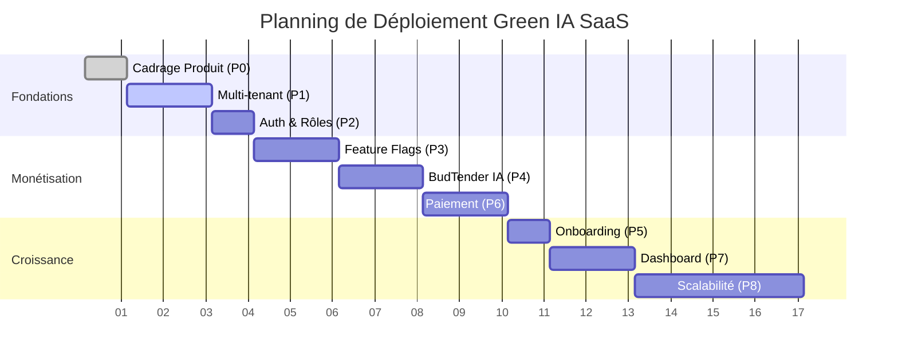

# 🧭 Roadmap Stratégique — Green IA SaaS

> **Progression Globale**
> 
> *15% des objectifs SaaS atteints*

> Une roadmap SaaS structurée, réaliste et directement alignée avec les ambitions de **Green IA**. Ce plan permet de transformer une application locale en un véritable SaaS scalable, monétisable et intégrant l'IA.

---

## 📊 Aperçu Global

| Phase | Focus | Statut | Temporalité |
| :--- | :--- | :--- | :--- |
| **0** | Cadrage Produit | ✅ Terminé | Semaine 0 |
| **1** | Fondations Multi-tenant | 🚀 En cours | Semaines 1–2 |
| **2** | Auth & Rôles SaaS | ⏳ À venir | Semaine 3 |
| **3** | Feature Flags & Plans | ⏳ À venir | Semaines 4–5 |
| **4** | BudTender IA (Premium) | ⏳ À venir | Semaines 6–7 |
| **5** | Onboarding Master | ⏳ À venir | Semaine 8 |
| **6** | Monétisation & Stripe | ⏳ À venir | Semaines 9–10 |
| **7** | Dashboard & Analytics | ⏳ À venir | Semaines 11–12 |
| **8** | Scalabilité & Revente | 🔮 Vision | Long terme |

---

## 🗺️ Timeline de Développement

---

## 🛠️ Détail des Phases

### 📍 PHASE 0 — Cadrage Produit
> [!NOTE]
> **Objectif :** Figer la vision SaaS avant de coder.

- [x] **Client cible :** Boutique CBD physique / e-commerce.
- [x] **Problème résolu :** Conversion + Automatisation + IA.
- [x] **Modules SaaS définis :**
    - Core e-commerce
    - BudTender IA
    - POS (Point of Sale)
    - Abonnements & Fidélité
- [x] **Modèle de pricing :** Quota mensuel vs Paiement à l'usage.

**🎯 Sortie :** Vision produit + Pricing figé.

---

### 📍 PHASE 1 — Multi-tenant (Fondations)
> [!IMPORTANT]
> **Objectif :** 1 plateforme → N boutiques. Passage d'une structure mono-client à une infrastructure distribuée.

- [ ] **Base de données :**
    - [ ] Créer la table `shops`.
    - [ ] Ajouter `shop_id` sur toutes les tables métier.
    - [ ] Migration progressive (sans perte de données).
- [ ] **Sécurité :**
    - [ ] Mise en place de RLS (Row Level Security) strict par `shop_id`.
    - [ ] Gestion des relations (Un utilisateur = 1 ou plusieurs shops).

> [!TIP]
> Supabase est idéal pour cette phase grâce à ses politiques RLS natives.

**🎯 Sortie :** Isolation complète des données par boutique.

---

### 📍 PHASE 2 — Auth & Rôles SaaS
> [!NOTE]
> **Objectif :** Structurer les accès comme un véritable logiciel d'entreprise.

- [ ] **Hiérarchie des rôles :**
    - `Owner` : Gestion complète du shop + invitation staff.
    - `Admin` : Gestion opérationnelle.
    - `Staff` : Accès limité aux ventes/inventaires.
- [ ] **Implémentation :**
    - Middleware frontend pour la protection des routes.
    - RLS backend basé sur les claims JWT.

**🎯 Sortie :** Système de gestion d'équipe robuste par boutique.

---

### 📍 PHASE 3 — Feature Flags & Plans
> [!NOTE]
> **Objectif :** Monétiser proprement en activant/désactivant les fonctionnalités selon le plan.

- [ ] **Infrastructure de paie :**
    - Table `subscriptions` (Plan, Statut, Limites).
- [ ] **Feature Flags :**
    - Configuration dynamique : `{ ai: true, pos: false, subscriptions: true }`.
- [ ] **Contrôle d'accès :**
    - UX (Frontend) : Cacher les boutons inaccessibles.
    - Gardiens (Backend) : Bloquer les requêtes API non souscrites.

**🎯 Sortie :** Plans activables sans redéploiement (Agilité commerciale).

---

### 🚀 PHASE 4 — BudTender IA (Produit Phare)
> [!IMPORTANT]
> **Objectif :** Transformer l'IA en levier business unique sur le marché.

- [ ] **Personnalisation par boutique :**
    - Prompts sur mesure et tonalité de marque.
    - Catalogue indexé et filtré par shop.
- [ ] **Intelligence Contextuelle :**
    - Mémoire IA cross-session par client.
- [ ] **Économie de l'IA :**
    - Quotas de messages / mois.
    - Système d'alertes de dépassement (Upsell).
- [ ] **Analytics IA :**
    - Dashboard de conversion post-IA pour les marchands.

**🎯 Sortie :** Le BudTender devient un produit SaaS autonome et différenciant.

---

### 📍 PHASE 5 — Onboarding Automatisé
> [!NOTE]
> **Objectif :** Réduire le churn en permettant à un client d'être opérationnel en < 10 mins.

- [ ] **Wizard de configuration :** Nom, Logo, Couleurs, Méthodes de paiement.
- [ ] **Seeding intelligent :** Données de démo pour projeter le client.

**🎯 Sortie :** Activation rapide et réduction du support client.

---

### 📍 PHASE 6 — Paiement Récurrent (Stripe)
> [!NOTE]
> **Objectif :** Assurer un MRR (Monthly Recurring Revenue) stable.

- [ ] Intégration Stripe Billing.
- [ ] Gestion des Upgrades/Downgrades automatiques.
- [ ] Facturation automatisée et conformité TVA EU.

**🎯 Sortie :** SaaS officiellement monétisé.

---

### 📍 PHASE 7 — Dashboard SaaS Admin
> [!NOTE]
> **Objectif :** Centraliser le pilotage du business pour l'owner de Green IA.

- [ ] **Super Admin Dashboard :** MRR, Churn, Usage IA global, Logs boutiques.
- [ ] **Client Dashboard :** Consommation, Modification de plan en 1 clic.

**🎯 Sortie :** Produit pilotable et prêt pour le passage à l'échelle.

---

### 📍 PHASE 8 — Scalabilité & Revente (Vision)
> [!TIP]
> **Objectif :** Maximiser la valorisation (x3 à x6 ARR).

- [ ] White-label (Marque blanche).
- [ ] Domaines personnalisés (`shop.customer.com`).
- [ ] BudTender Standalone (Widget API pour sites tiers).

---

## 🎯 Résumé Stratégique

| Étape | Valeur Ajoutée |
| :--- | :--- |
| **Multi-tenant** | Architecture SaaS réelle |
| **Feature flags** | Monétisation granulaire |
| **BudTender IA** | Différenciation concurrentielle majeure |
| **Onboarding** | Conversion optimisée |
| **Abonnements** | Revenus récurrents (MRR) |
| **Dashboard** | Pilotage & Scalabilité |
| **White-label** | Potentiel de revente élevé |

---

> [!CAUTION]
> **Verdict :** Le projet est techniquement prêt pour cette mutation. Cette roadmap transforme un excellent prototype en un SaaS de classe mondiale.

**Prochaines étapes suggérées :**
1. 📈 **Roadmap ultra-détaillée** semaine par semaine.
2. 💾 **Schéma SQL final** multi-tenant.
3. 💎 **Pricing optimisé** pour maximiser l'ARR.
4. 🤖 **Transformation du BudTender** en service autonome.
